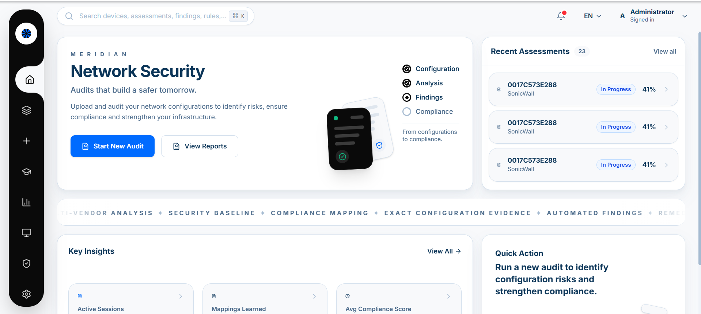
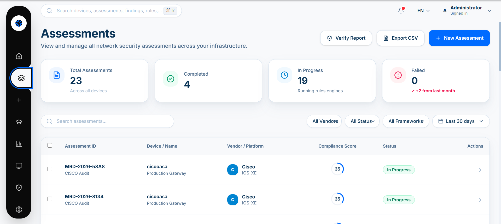
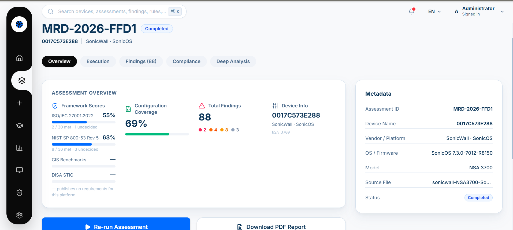
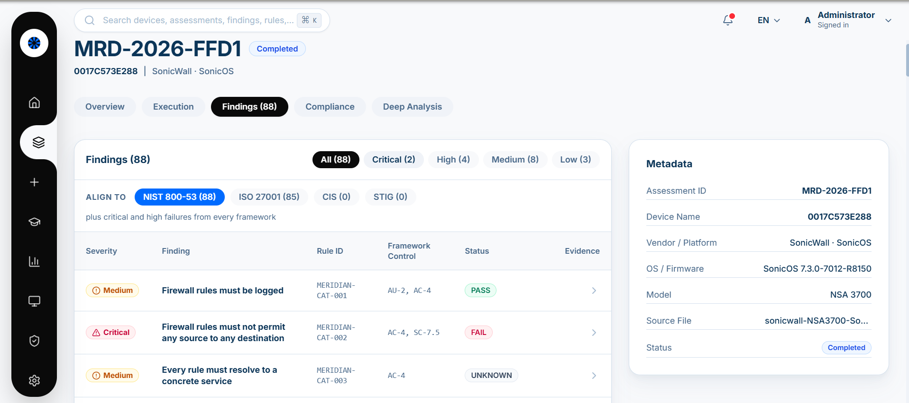
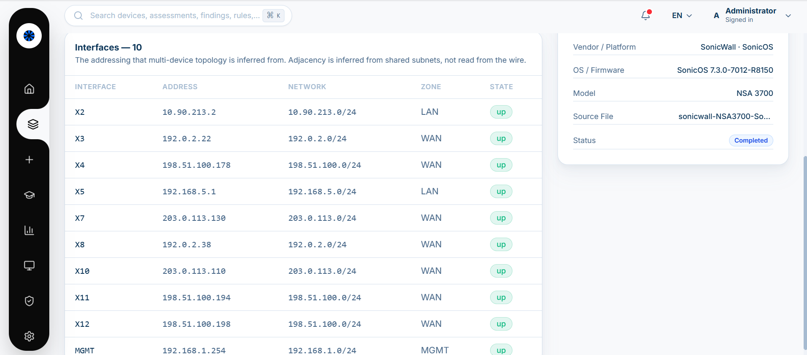
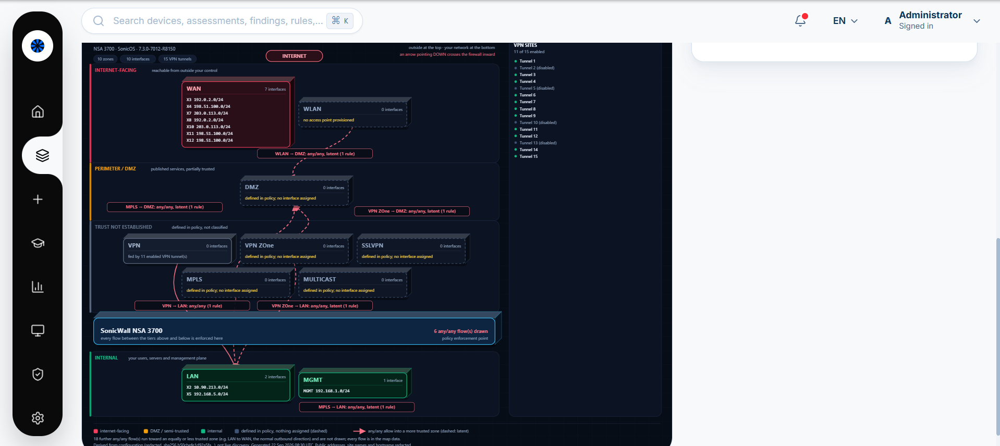
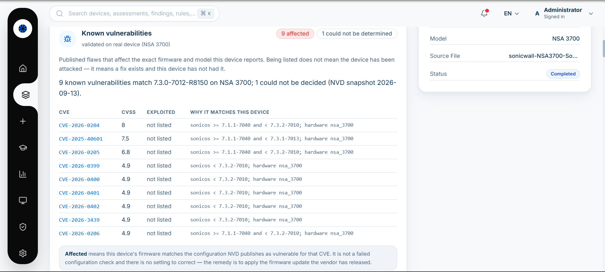
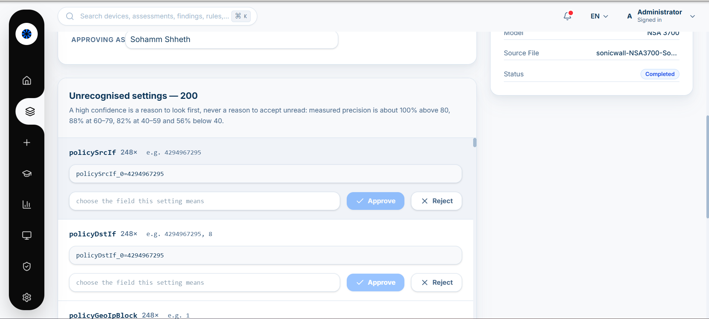

# MERIDIAN

**Multi-Vendor Network Compliance and Security Auditor**

Give MERIDIAN a device configuration, either uploaded or pulled over SSH, and
it returns a compliance assessment where every single claim points back to the
file and line it came from. No verdict is offered that the configuration
itself cannot support.

It works across vendors because vendor knowledge lives in data rather than in
code. Adding a platform means writing a YAML file, not editing the engine.

---

## Contents

- [The console](#the-console)
- [How it decides](#how-it-decides)
- [What it does](#what-it-does)
- [Frameworks](#frameworks)
- [Architecture](#architecture)
- [Getting it running](#getting-it-running)
- [Adding a vendor](#adding-a-vendor)
- [Securing the console itself](#securing-the-console-itself)
- [What is not in this repository](#what-is-not-in-this-repository)
- [Where the packs actually stand](#where-the-packs-actually-stand)

---

## The console

### Overview

The landing page answers the question you ask first thing in the morning: what
is in flight, what has the tool learned recently, and how is the estate doing
overall.



### Assessment register

Every assessment is kept and stays addressable, with its vendor, platform,
score and status. You can export the list as CSV. You can also hand a report
back to the tool and have it re-checked against its signature, which matters
when someone asks whether a report has been edited since it was issued.



### Assessment overview

Each framework gets its own score, shown with how many of its requirements
were met and how many are still undecided. Coverage sits next to the score
rather than buried below it. If a framework publishes nothing for the platform
in front of it, the view says so instead of printing a zero and letting you
draw the wrong conclusion.



### Findings

Pick a framework and the findings realign to it. Each one carries a severity,
the control that produced it, the requirements it cites, and a result state.
PASS, FAIL and UNKNOWN are three different things here and they look like
three different things. A control nobody could evaluate is never dressed up as
a pass.



### Interface inventory

The addressing behind the topology view. Adjacency between devices is worked
out from shared subnets rather than observed on the wire, and the page says as
much, because an inference presented as a measurement is a claim the tool has
not earned.



### Topology

Zones are stacked by how much you trust them, with the enforcement point drawn
in between. Every any/any flow heading into a more trusted zone is drawn and
labelled with the rule that allows it. Where a zone has no interface in it
yet, the flow is marked latent: the policy permits it, but nothing can take
that path today.



### Known vulnerabilities

Published flaws affecting the precise firmware and hardware model the device
reports. Both have to match before anything is listed, because "some version
of this product was vulnerable once" is not a finding. The page states the
date of the vulnerability data it used, and it separates being affected from
failing a configuration check. There is no setting to fix here. The fix is a
firmware update.



### Training

Settings the packs do not recognise are queued for review and ranked by
confidence. The measured precision of each confidence band is printed on the
page, so a high score tells you where to look first rather than pretending the
decision has already been made.



---

## How it decides

### Not knowing is never a pass

This is the rule the rest of the design hangs off. If a control could not be
evaluated, the assessment says so. It does not quietly become a PASS and it
does not vanish into a zero.

Most tools in this space report two states. MERIDIAN reports seven, because
two is not enough to be honest with.

| State | What it means |
|---|---|
| `PASS` | Evaluated, and the device satisfies it. |
| `FAIL` | Evaluated, and it does not. |
| `PARTIAL` | The control covers several instances. Some comply, some do not. |
| `NOT_APPLICABLE` | Genuinely does not apply here, and the reason is recorded. |
| `UNKNOWN` | Could not be evaluated. Not a pass, not a failure. |
| `MANUAL_REVIEW` | Needs a person. No automated verdict would hold up. |
| `ERROR` | The check itself broke. That is our bug, not the device's. |

### A score without its coverage is marketing

`score_pct` counts only the controls that were actually decided, and it is
never shown without `assessed_pct` beside it. Suppose the tool could read 40%
of the relevant settings and everything it read passed. That device scores
100% at 40% coverage. Reporting it as "100%" would be true and useless at the
same time.

### The rule we are strictest about

`UNKNOWN` stays in the denominator, so it drags coverage down and you notice
it. `NOT_APPLICABLE` leaves scoring altogether, which means a wrong one
quietly pushes the score **up** by removing a hard control from the sum.

That makes over-applying N/A the easiest way for a tool like this to flatter a
device, so every exclusion has to earn itself one of three ways:

1. **The platform genuinely cannot do it.** Declared per field or per domain,
   with a written reason.
2. **The feature is not in use.** Gated on a setting that was actually
   observed, and that setting is cited as the evidence.
3. **Neither.** Then it is UNKNOWN and it stays in the denominator.

Every N/A across every bundled configuration carries its justification. A test
walks all of them and fails on the first one that cannot explain itself.

---

## What it does

### Reading configurations

| | |
|---|---|
| Multi-vendor parsing | 13 mapping packs, 10 platforms, 6 grammar families, all expressed as data |
| Live collection | Read-only `show` commands over SSH. Credentials are used for the session and never stored |
| Record accounting | Every source record is counted as parsed, unreadable, mapped or seen-but-unmapped, so parsing coverage is itself measurable |
| Redaction | Addresses and secrets are pseudonymised on the way in. Network prefixes survive the process, so subnet relationships hold and topology still works |
| Parser cross-check | Two independent parsers read the same device and their results are reconciled, so one parser's bug does not quietly become a finding |

### Judging them

| | |
|---|---|
| Control catalogue | 88 controls, each citing the evidence behind its verdict |
| Framework mapping | Findings map to external requirements with the provenance chain kept intact |
| Strictness profiles | A control can be judged against the standard being applied rather than one fixed threshold |
| Manual review | Anything that cannot be decided mechanically is routed to a person instead of guessed at |

### Policy analysis

| | |
|---|---|
| Rule hygiene | Dead, shadowed, redundant and over-broad rules |
| Reachability | Would this traffic get through, and which rule decides it |
| Blast radius | From a compromised zone, every zone reachable on lateral-movement ports and the rule that permits each hop |
| Recertification | Which rules are due for review. Deletion is only suggested when three independent signals agree |
| Log correlation | Whether a rule is genuinely unused or its counters were simply reset |

### Fixing them

| | |
|---|---|
| Remediation | Vendor-correct commands, checked against lockout conditions before being offered |
| Hardened configuration | A complete hardened config for the target vendor, anchored on observed evidence and written in the device's own value formats. A type mismatch is refused rather than coerced |
| What-if | Re-scores a copy with fixes applied or rules disabled, and warns when an IPv6 twin would still let the traffic through |

### Context around them

| | |
|---|---|
| Multi-device topology | A fabric assembled from several assessed devices, drawn by trust tier |
| Change tracking | Snapshot and diff, keeping "the device changed" separate from "our analysis changed" |
| Known vulnerabilities | Firmware checked against a dated NVD snapshot and CISA KEV. Version and hardware model must both match |
| ATT&CK mapping | The adversary technique each control stands in front of |
| VPN | Per-tunnel PFS, anti-replay, SA lifetimes, and management exposure through the tunnel |
| Wireless | Open, WEP and TKIP, protected management frames, guest isolation, cleartext PSKs |
| Host firewall | Windows and iptables, through the same analysers used for appliances |
| Cloud | AWS security groups, Azure NSGs, GCP VPC firewall rules |

### Reporting

| | |
|---|---|
| Tamper-evident reports | A content hash and signature, so later edits are detectable |
| Scheduled re-collection | Periodic re-assessment with alerts on drift |
| Fleet view | Cross-device reporting, CSV export |
| Learning loop | Unrecognised settings queued for review, ranked by calibrated confidence |

### Why the extended checks sit outside the score

VPN, wireless and vulnerability results appear next to the compliance score
and deliberately do not move it. Folding them into the 88-control catalogue
would have changed the score and coverage of every device already assessed,
including reports that had already gone out. They follow the same evidence
rules as everything else: a failure names the setting behind it, and anything
that cannot be decoded is reported as undecided rather than guessed.

---

## Frameworks

**5,785 requirements**, across:

| Framework | Scope |
|---|---|
| NIST SP 800-53 | Security and privacy controls |
| DISA STIG | Defense hardening guidance |
| CIS Benchmarks | Cited by identifier and short title |
| ISO/IEC 27001 | Cited by clause number and short title |
| NIST SP 800-171 r3 | Controlled unclassified information |
| PCI DSS 4.0 | Payment card data security |
| CMMC | Cybersecurity maturity model certification |
| NERC CIP | Critical infrastructure protection |

Provenance is chained rather than asserted: STIG to CCI to 800-53 to ISO 27001
and 800-171.

---

## Architecture

| Layer | Built with | Job |
|---|---|---|
| Engine | Python, FastAPI | Parsing, normalisation, evaluation, reporting |
| Console | React, TypeScript, Vite | The operator interface |
| Mapping packs | YAML | Vendor and platform support |
| Control catalogue | YAML | Control definitions and framework citations |

The console is built into the engine package, so one process serves the API
and the interface from a single origin.

---

## Getting it running

You need Python 3.11 or later, and Node 20 or later to build the console.

```bash
python -m venv .venv
.venv\Scripts\activate          # Windows
source .venv/bin/activate       # Linux, macOS

pip install -r requirements.txt

cd frontend && npm install && npm run build && cd ..
```

Then start it:

```bash
python -m uvicorn meridian.api.app:app --host 127.0.0.1 --port 8000
```

The console is at `http://127.0.0.1:8000/dashboard` and the API documentation
at `http://127.0.0.1:8000/docs`.

For console work with hot reloading, start the engine as above and run the dev
server alongside it. It proxies the API, so the browser still sees one origin.

```bash
cd frontend && npm run dev
```

One thing worth knowing: the dev server and the engine-served console are
different origins, and sessions are per origin. Signing in on one does not
sign you in on the other.

### Settings

| Variable | What it does |
|---|---|
| `MERIDIAN_ADMIN_USER` | Console account name |
| `MERIDIAN_ADMIN_PASSWORD_HASH` | bcrypt hash of the console password |
| `MERIDIAN_CONSOLE_AUTH` | Set to `0` to turn off console authentication for local work |
| `MERIDIAN_API_TOKEN` | Bearer token for programmatic access |
| `MERIDIAN_DATA_DIR` | Where uploads and the assessment store live |
| `MERIDIAN_PACKS_DIR` | Where mapping packs live |
| `MERIDIAN_CORS_ORIGINS` | Permitted cross-origin callers |
| `MERIDIAN_MONITOR` | Set to `1` for scheduled re-collection |
| `MERIDIAN_SHOW_PAIRING` | Set to `1` to keep the authenticator QR available after enrolment. For demonstrations only |

### Threat data

Vulnerability lookup and ATT&CK mapping run from local files, so results
reproduce and each one states the date of the data behind it. Anything derived
from data more than thirty days old says so before it says anything else.

```bash
python -m tools.fetch_cve
```

---

## Adding a vendor

A new platform is a YAML file, not a code change.

```yaml
vendor: acme
platform: acme_os
reader: indented
mappings:
  - field: management.ssh.enabled
    regex: '^ip ssh server$'
    value: {const: true}
not_applicable_fields:
  authentication.enable_secret: "AcmeOS has no enable-secret concept"
```

A pack that has only ever been tested against a fixture written next to it
stays at version `0.9`, and a test stops it reaching `1.0` until it has faced
output from a real device. That rule exists because real configurations keep
finding bugs that invented ones cannot. A downloaded PAN-OS export broke the
XML reader within minutes of first contact.

---

## Securing the console itself

This tool reports on other people's access control, so it should survive the
same questions.

| What it does | The control it answers |
|---|---|
| Console password stored as a bcrypt hash, with no plaintext in the repository or its history | `MERIDIAN-PLT-002` |
| Account lockout after repeated failures | `MERIDIAN-EXT-013` |
| Multi-factor authentication for administrative access, by TOTP | `MERIDIAN-EXT-014` |
| Failed sign-ins recorded | `MERIDIAN-EXT-021` |

Codes are standard RFC 6238, so any normal authenticator app works. A code is
accepted once and once only. Replaying one that has already been used is
refused, which matters because the clock tolerance that makes TOTP usable also
widens the window an observed code stays valid in.

The pairing endpoint hands out the shared secret, so it closes after the first
successful sign-in. It can be held open for demonstrations with
`MERIDIAN_SHOW_PAIRING=1`, and when it is, the engine logs a warning at
startup saying the control has been relaxed. A weakened control that announces
itself is a demo setting. One that stays quiet is a vulnerability.

---

## What is not in this repository

| Left out | Why |
|---|---|
| CIS Benchmark and ISO/IEC 27001 text | Copyrighted. Cited by identifier and short title only. The licence boundary is enforced in the type system, not by good intentions |
| Vendor documentation | Keeping a local copy to write mappings against is fair use. Republishing a vendor's command reference is not. Sources are recorded so anyone can fetch their own |
| Real configurations and assessment history | The change store keys on hostname, serial and configuration digest. Publishing it would expose live infrastructure |
| NIST OSCAL, MITRE ATT&CK and ATLAS corpora | Public and freely available, but large, and the tools here re-fetch them on demand |

`.gitignore` enforces these, and for the licensed material so does the code.

---

## Where the packs actually stand

SonicWall, PAN-OS, Cisco IOS-XE, Cisco ASA and Juniper are validated against
real or captured configurations. Arista, Aruba, FortiOS, Azure and GCP sit at
version `0.9`, validated against constructed fixtures while they wait for real
exports.

Of the extended checks, VPN, vulnerability and wireless are validated against
a real SonicWall NSA 3700 export of 92,635 settings. The Catalyst 9800
wireless adapter is validated against a fixture built from the vendor's
published command reference, and every result it produces says so.

```bash
python -m pytest -q
```
